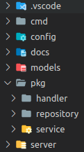

# Golang API example

## Build and Run
Run tests and show the result
```
make test
```
(Build and) run Docker and DB container
```
make run
```
Build or rebuild Docker container
```
make build
```
Stop Docker containers
```
make stop
```

## Tech stack

Log default format - [Line delimited JSON](https://en.wikipedia.org/wiki/JSON_streaming#:~:text=Line%2Ddelimited%20JSON,-Not%20to%20be&text=Streaming%20makes%20use%20of%20the,whitespace%2C%20including%20newlines%20and%20returns.)

Time default format for logger- [RFC3339](https://en.wikipedia.org/wiki/ISO_8601#RFCs)

IDs stores as [UUID v4](https://en.wikipedia.org/wiki/Universally_unique_identifier#Version_4_(random))

[GIN](https://github.com/gin-gonic/gin) framework for REST endpoints

[Swagger](https://github.com/swaggo/swag) docs on /swagger/index.html 

[Testing library](https://github.com/stretchr/testify)

[Project layout](https://github.com/golang-standards/project-layout)



## Code samples

Graceful shutdown:
```golang
quit := make(chan os.Signal, 1)
signal.Notify(quit, syscall.SIGTERM, syscall.SIGINT)
<-quit
```
Dependency Injection:
```golang
repo := repository.NewRepository(db)
appService := service.NewAppService(repo)
handlers := handler.NewHandler(appService)
```
Enviroment configuration:
```golang
func Get() *Config {
	once.Do(func() {
		err := envconfig.Process("", &config)
		if err != nil {
			logrus.Fatal(err)
		}
		validate(config)
	})
	return &config
}
```